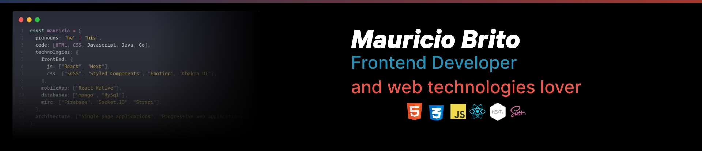

# Hello World 👋 I'm Mauricio 👨‍💻

<!--
**mauriciobrito7/mauriciobrito7** is a ✨ _special_ ✨ repository because its `README.md` (this file) appears on your GitHub profile.

Here are some ideas to get you started:

- 🔭 I’m currently working on ...
- 🌱 I’m currently learning ...
- 👯 I’m looking to collaborate on ...
- 🤔 I’m looking for help with ...
- 💬 Ask me about ...
- 📫 How to reach me: ...
- 😄 Pronouns: ...
- ⚡ Fun fact: ...
-->

## 🌱 I’m currently learning ...

- <a  href="https://nextjs.org/">Next.js</a>
- <a  href="https://reactnative.dev/">React Native</a>

## 🔭 I’m currently working on ...

- Building projects and my portfolio website.

# Find me around the web 🌎:

- My profile on <a  href="https://www.linkedin.com/in/mauricio-brito-62b0a6140/">LinkedIn</a> 💼
- Tinkering with interactions on <a href="https://codepen.io/MauricioBrito7"> Codepen</a> 🏓
- Learning in public on <a href="https://leetcode.com/mauriciobrito7/">LeetCode</a> ✍
